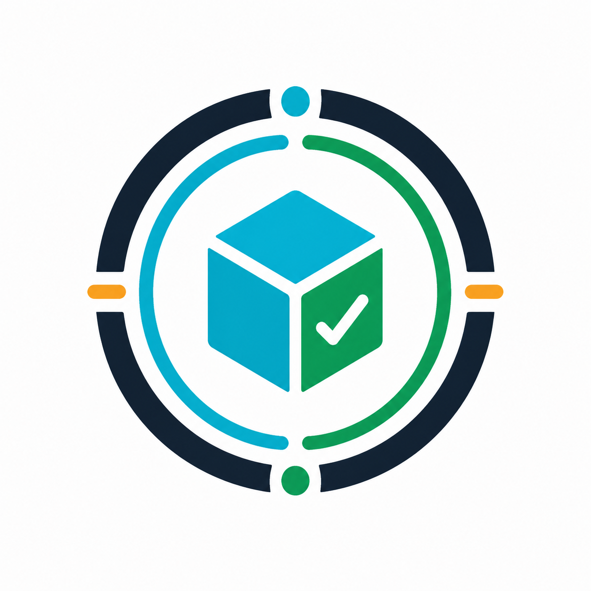
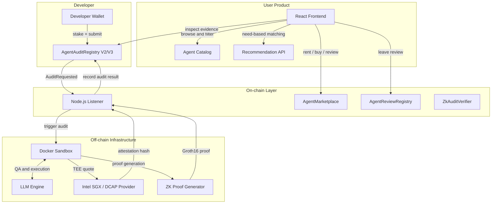

<div align="center">



# AgentLens

[](https://soliditylang.org/)
[](https://reactjs.org/)
[](https://www.intel.com/content/www/us/en/developer/tools/software-guard-extensions/overview.html)
[](https://docs.circom.io/)

可信 AI Agent 选型、审计与交易基础设施。

[线上演示](http://154.89.157.252:5173/zh) · [Agent 列表](http://154.89.157.252:5173/zh/agents) · [需求推荐](http://154.89.157.252:5173/zh/recommend) · [发布入口](http://154.89.157.252:5173/zh/publish)

</div>

---

AgentLens 面向 AI Agent 经济中的信任问题：在用户雇佣、试用或集成一个 Agent 之前，平台先帮助用户看清它适合什么场景、风险在哪里、如何开始使用，以及是否有可验证的审计和运行证据。

当前版本采用双层结构：

- 前台是面向终端用户的 Agent 选型决策平台，支持搜索、筛选、详情页、起步指南和需求推荐。
- 后台是平台原生 Agent 的信任与交易基础设施，包含链上注册、沙箱审计、TEE attestation、ZK proof、动态信誉、租赁和评论能力。

## 核心能力

- 结构化 Agent 目录：将 Agent 拆成可比较字段，包括场景、风险、上手难度、接入方式、官方资源、起步指南和信任层级。
- 需求推荐：用户可以直接描述任务目标，平台根据场景、风险、可信度和上手成本返回候选 Agent。
- 信任层级：用 Tier 0 到 Tier 3 表达证据强度，从基础收录、外部观察，到审计回执、attestation 与链上信誉。
- 六维风险画像：审计系统围绕 Security、Task Execution、Cognitive、Environment、Engineering、Compliance 六个维度生成风险与场景适配结论。
- TEE attestation：沙箱审计可以绑定 Intel SGX/DCAP 远程证明，让审计执行过程具备硬件级完整性证据。
- ZK proof：通过 circom/snarkjs 证明审计分数和 Agent 指纹计算过程，而不暴露底层私有代码。
- 可信交易市场：合约层支持 Agent 质押、租赁、购买、访问权检查、用户评论与动态信誉更新。

## 架构



## 仓库结构

```text
frontend/   React + Vite 前端，包含首页、Agent 列表、详情页、推荐页和发布入口
contracts/  Solidity 合约、Hardhat 部署脚本和合约测试
sandbox/    审计沙箱、监听器、报告网关、attestation、推荐与平台 API
infra/      Polygon Edge、本地链、attestation 与生产部署脚本
docs/       集成指南、验证方法、TEE 状态和本地开发 runbook
```

## 本地运行

### 环境要求

- Node.js 20+
- Docker 和 Docker Compose
- Rust，ZK circuit 编译时需要
- Polygon Edge 本地节点，完整链上流程需要

### 前端快速启动

```bash
cd frontend
npm install
npm run dev
```

前端默认读取 `frontend/.env.local`。最小配置如下：

```bash
VITE_AUDIT_RPC_URL=http://127.0.0.1:18545
VITE_AUDIT_REGISTRY_ADDRESS=0x0000000000000000000000000000000000000000
VITE_AUDIT_CHAIN_ID=302512
VITE_AUDIT_REPORT_GATEWAY_URL=https://ipfs.io/ipfs/
VITE_AUDIT_APPEAL_API_URL=http://127.0.0.1:3000/api/appeals
VITE_PLATFORM_API_URL=http://127.0.0.1:8790
```

### 合约与本地链

```bash
cd infra/polygon-edge-local
docker compose up -d

cd ../../contracts
npm install
npm run compile
npm run deploy:edge
```

部署后将 registry 地址写入 `frontend/.env.local` 的 `VITE_AUDIT_REGISTRY_ADDRESS`。

### 沙箱和平台 API

```bash
cd sandbox
npm install
npm run build
npm run run:report:gateway
npm run run:platform:api
```

常用脚本：

```bash
npm run run:listener
npm run run:recommendation:api
npm run run:attestation:api
npm run run:platform:mvp-smoke
```

## 核心组件

### 前端 (`frontend`)

- `HomePage`：首页定位、搜索入口、场景入口、重点维护 Agent 和信任基础设施说明。
- `AgentListPage`：全集列表，支持关键词、场景、来源、风险、上手难度、信任层级等筛选。
- `AgentDetailPage`：决策摘要、适用/不适用场景、风险缓解、起步指南、官方资源和链上证据。
- `RecommendPage`：基于自然语言需求生成候选推荐，支持免费规则和平台积分模式。
- `AuditReportPage`：展示审计报告、appeal 提交、attestation pinning 和证据校验信息。

### 合约 (`contracts`)

- `AgentAuditRegistryV2/V3`：Agent 注册、质押、审计结果、申诉、信誉和时间衰减逻辑。
- `AgentMarketplace`：租赁、买断、访问权检查和价格配置。
- `AgentReviewRegistry`：基于访问权的六维评分与链上评论哈希。
- `ZkAuditVerifier`：记录通过验证的 Groth16 审计分数证明和 Agent 指纹证明。

### 审计沙箱 (`sandbox`)

沙箱负责拉起被测 Agent、执行标准化测试、生成六维评分、构建审计报告，并把 report hash、attestation hash、评分和状态写回链上。它也包含报告网关、appeal API、recommendation API、platform API 和 attestation 验证相关 CLI。

### ZK circuits (`contracts/zk`)

- `AuditScoreVerifier`：证明六维分数和加权总分来自指定审计数据。
- `AgentFingerprint`：在不暴露源码的前提下，将 Agent 身份和行为特征绑定到特定 token。

## 验证命令

```bash
cd frontend
npm run build
npm test

cd ../contracts
npm test

cd ../sandbox
npm test
```

如果只改目录数据，可以先跑：

```bash
cd frontend
npm run validate:catalog
```

## 相关文档

- [Agent 集成指南](docs/agent-integration-guide.md)
- [验证方法](docs/verification-methods.md)
- [本地开发 Runbook](docs/local-development-runbook.md)
- [TEE 生产状态](docs/status/2026-04-16-tee-production.md)
