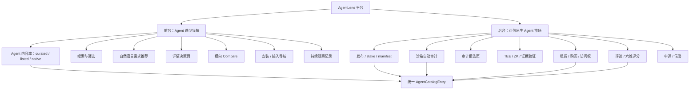
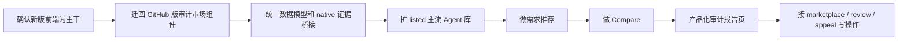

# AgentLens 前端集成任务知识图谱

日期：2026-06-05

## 0. 当前读取状态

- 已读取本地项目：`agent-web3-main-f46e7eca3cb6f52c933448f0c44655810b9adec8`
- 已读取本地 PRD：`product-requirements-v1-reorganized.md`
- 已读取当前前端：`frontend/src`
- 已读取合约能力：`contracts/src`
- 已读取 sandbox/API 能力：`sandbox/src`
- 已读取用户提供的 GitHub zip：`/Users/zhangjinghan/Downloads/AgentLens-main.zip`
- 已解压 GitHub 快照：`AgentLens-main`
- GitHub 版与当前项目对比结论：`contracts`、`sandbox`、`infra` 基本一致；最大差异在 `frontend/src`。GitHub 版是旧的链上审计市场前端，当前版是新的选型导航/内容目录前端。
- 线上页面：用户确认 `https://5173-ijmqsjtxb0lvbw808rru8-31b25df8.sg1.manus.computer/zh/agent/elevenlabs` 可用；本轮浏览器访问该域名超时，待后续重试。

## 1. 平台定位

AgentLens 当前应按“双层平台”设计，不新增额外大功能：

1. 前台：可信 AI Agent 选型导航
   - 面向终端用户，解决“我该选哪个 Agent、为什么、怎么开始”。
   - 核心路径：搜索/需求输入 -> 候选推荐 -> 对比 -> 详情决策 -> 官方入口或平台原生入口。

2. 后台：平台原生 Agent 信任与交易能力
   - 面向平台原生 Agent 与开发者。
   - 复用现有链上注册、沙箱审计、TEE attestation、ZK、租赁、评论、申诉、报告能力。

## 2. 总图

## 3. 当前前端已接功能

| 模块 | 当前状态 | 关键代码 |
| --- | --- | --- |
| 多语言路由 | 已接 | `frontend/src/app/routes.tsx`, `frontend/src/i18n` |
| 首页定位 | 部分已接 | `frontend/src/pages/HomePage.tsx` |
| Agent 列表 | 已接基础版 | `frontend/src/pages/AgentListPage.tsx` |
| 本地搜索/筛选 | 已接基础版 | `frontend/src/domain/filters.ts`, `SearchFilterBar.tsx` |
| curated/listed/native 三类目录 | 已接 | `frontend/src/data/catalog`, `useCatalog.ts` |
| 重点维护 Agent 起步指南 | 已接 11 个 | `frontend/src/data/catalog/onboarding` |
| Agent 详情决策页 | 部分已接 | `AgentDetailPage.tsx`, decision/trust/onboarding 组件 |
| Trust Tier | 已接规则版 | `frontend/src/domain/trustTier.ts` |
| 链上 native 读取 | 已接只读扫描 | `useNativeAgents.ts`, `agentAuditRegistryClient.ts` |
| 原生 Agent 链上可信面板 | 已接只读版 | `NativeChainPanel.tsx`, `useAgentCredit.ts`, `useAuditHistory.ts`, `useAgentRiskProfile.ts`, `useAgentPricing.ts`, `useAccessHistory.ts` |
| 原生 Agent 价格展示 | 已接只读展示，未接交易 | `PricingCard.tsx`, `NativeChainPanel.tsx` |
| 审计报告详情 | 已接只读版 | `AuditReportPage.tsx`, `auditReportClient.ts`, `appealClient.ts` |

## 3.1 GitHub 版已有功能

GitHub 版前端路径：`AgentLens-main/frontend/src`。

| 模块 | GitHub 版状态 | 可迁移价值 |
| --- | --- | --- |
| 链上 marketplace 首页 | 已有 | 可迁移统计条、排行榜、链上 Agent 卡片信息 |
| 链上 Agent 扫描 | 已有 | `useAgentList.ts` 支持分页、信誉、价格、TEE |
| Agent 链上详情 | 已有 | `AgentDetailPage.tsx` 展示 profile、reputation、risk、latest audit、history、reviews |
| 6 维雷达图 | 已有 | `RadarScoreChart.tsx`, `DimensionalScoreCard.tsx` |
| 场景适配 | 已有 | `RiskProfileCard.tsx`, `sceneSuitability.ts` |
| 审计历史 | 已有 | `AuditHistoryList.tsx`, `useAuditHistory.ts` |
| 审计报告页 | 已有 | `AuditReportPage.tsx` 读取链上 audit、CID report、校验 hash、展示 Q&A/资源/网络/原始 JSON |
| TEE 展示 | 已有 | `AttestationBadge.tsx`, `AttestationVerificationCard.tsx` |
| ZK 展示 | 已有 | `ZkVerificationBadge.tsx` |
| 租赁/价格/访问记录 | 部分已有 | `PricingCard.tsx`, `AccessHistoryCard.tsx`, `useAgentPricing.ts`, `useAccessHistory.ts` |
| 评论展示/提交 UI | 部分已有 | `ReviewSection.tsx`, `ReviewSubmitForm.tsx`, `useAgentReviews.ts` |
| 申诉提交 | 已有 | `AuditReportPage.tsx` 内含 slashed audit 申诉表单，`appealClient.ts` 已接 |

GitHub 版没有解决：

- 自然语言需求推荐。
- 大模型/embedding/RAG 搜索。
- 大量非维护主流 Agent 内容库。
- 当前新版的 curated/listed/native 统一内容模型。
- Compare 页面。
- 多语言与当前 Tailwind/shadcn UI 体系。

## 4. 底层已有但前端未完整接上的功能

| 功能 | 底层已有 | 前端状态 | 缺口 |
| --- | --- | --- | --- |
| 审计报告详情 | `auditReportClient.ts`, sandbox report gateway, report schema | 已接只读版 | 仍需更完整的中文产品化文案、native 路由真实 auditId/index 桥接、ZK/TEE 更清晰解释 |
| Compare | PRD 已定义；GitHub README 提到“compare risk profiles”但无 Compare 页面 | `/compare` 占位，详情页按钮 disabled | 需要候选状态、URL 参数、对比页、规则结论 |
| 需求推荐 | PRD 已定义 | `/recommend` 占位 | 需要自然语言/规则推荐服务或前端规则引擎 |
| 大模型搜索 | 无前端接入 | 搜索只是字符串过滤 | 需要需求解析、场景映射、候选排序、推荐理由 |
| 非维护主流 Agent 搜索扩展 | listed 数据只有一小批 | 搜索不到大量主流 Agent | 需要外部 Agent 数据源或 GitHub 项目已有数据导入 |
| 发布 Agent | `AgentAuditRegistryV3.stake` 与文档已有 | `/publish` 占位 | 需要钱包、manifest 校验、交易提交、成功跳转 |
| 申请审计 | 合约 + listener 已有 | 详情页按钮 disabled | 需要写交易入口和状态读取 |
| 租赁/购买 | `AgentMarketplace` 已有 | 只有价格卡，未交易 | 需要钱包、rent/buy、hasAccess、访问状态 |
| 评论/六维评分 | `AgentReviewRegistry`, `reviewClient.ts`, comment API 已有 | 页面未接 | 需要评论列表、提交表单、访问权门禁 |
| 申诉 | `appealClient.ts`, sandbox appeal API 已有 | 审计页已接 slashed audit 申诉入口 | 仍需真实后端联调、状态轮询、错误文案 |
| 信任记录聚合 | 链上审计/租赁/评论/观察均可作为事件 | 未聚合 | 需要 TrustRecord timeline |
| ZK 证明 | 合约 + sandbox proof 生成已有 | 前端未展示 | 需要 proof verified 状态、proof 链接或技术折叠区 |
| TEE attestation | sandbox + env config + attestation hash | 只在 TrustEvidenceCard 简略显示 hash | 需要报告页验证语义和用户解释 |
| 外部观察记录 | `latestObservedAt`/`observationSummary` 已有基础字段 | 只有单条字段 | 需要完整变化记录列表和最近更新模块 |

## 5. 第一阶段平台功能边界

第一阶段只做现有两部分代码已经覆盖的功能，不扩展到 CMS、企业协作、全自动爬虫。

必须包含：

- Agent 内容库：curated / listed / native 统一模型
- 搜索与筛选：关键词、场景、风险、复杂度、接入方式、Trust Tier、是否有指南/审计/可租赁
- 需求推荐：用户输入自然语言需求后返回 3-5 个候选 Agent
- 主流 Agent 可搜索：把普通收录数据扩到“市面主流但未深度维护”的 Agent
- Agent 详情：适合谁、不适合谁、风险、起步指南、官方资源、信任证据
- Compare：2-4 个 Agent 横向对比并给出规则结论
- 信任报告页：用户摘要 + 技术证据
- 平台原生 Agent：展示审计、租赁/购买、评论能力；交易闭环可作为后续阶段

## 6. 当前最关键缺口

1. 推荐入口没有真实能力
   - `/recommend` 还是占位。
   - 首页搜索只是跳转 `/agents?q=...`，没有 LLM/规则理解。

2. 搜索范围太小
   - curated 重点维护 11 个。
   - listed 普通收录 16 个，仍不足以覆盖大量市面主流 Agent。
   - 无外部数据源或 GitHub AgentLens 数据导入。

3. 对比闭环没做
   - `/compare` 占位。
   - `AgentDetailHeader` 的“加入对比”是 disabled。

4. 审计报告页已完成最小衔接，但还没产品化
   - `AuditReportPage` 已能读取链上 audit、读取 CID report、校验 hash、展示报告 body/维度分/Q&A/trace/raw JSON。
   - 没有 RPC/报告服务时能显示错误态，不会白屏。
   - 仍需把 native 最新审计链接从 `latest/0` 改成真实 `auditId/auditIndex`。

5. 市场交易/评论/申诉只停在 client 或合约层
   - marketplace/review/appeal 前端 lib 存在。
   - 缺钱包、写交易、表单和页面状态。

6. 线上 SPA 静态预览方式要注意
   - Python 静态服务器直接访问 `/zh/agents` 会 404，需要 Vite dev server 或 history fallback。

## 7. 推荐实施顺序

当前已完成第一轮最小业务衔接：保留新版前端主干，迁入旧版链上审计/可信档案能力的只读闭包。

## 8. 迁移原则

当前新版前端应作为主干，因为它已经承载“终端用户选型导航”的产品方向：

- 保留新版的路由、多语言、主题、Tailwind/shadcn 组件体系。
- 保留新版 `AgentCatalogEntry` 作为唯一 Agent 内容模型。
- 从 GitHub 版迁移“链上原生 Agent 可信档案”能力，而不是直接覆盖新版前端。
- 旧版组件迁移时要改造成新版 UI 分层：`components/native`、`components/trust`、`pages/AuditReportPage` 等。

优先迁移清单：

1. `AuditReportPage.tsx` 的读链上 audit、读 CID report、hash 校验、报告 body、申诉表单。
2. `DimensionalScoreCard.tsx`、`RadarScoreChart.tsx`、`SecurityBoundaryCard.tsx`、`AuditQuestionsSection.tsx`、`SandboxExecutionSummary.tsx`。
3. `useAuditHistory.ts`、`AuditHistoryList.tsx`。
4. `useAgentRiskProfile.ts` 和 `RiskProfileCard.tsx` 的链上维度分场景适配逻辑。
5. `useAgentPricing.ts`、`AccessHistoryCard.tsx`。
6. `useAgentReviews.ts`、`ReviewSection.tsx`、`ReviewSubmitForm.tsx`。
7. `AttestationVerificationCard.tsx`、`ZkVerificationBadge.tsx`。

## 9. 第一轮衔接结果（2026-06-05）

本轮原则：

- 新版前端继续作为 trunk，不覆盖 `routes`、`layout`、`i18n`、`AgentCatalogEntry`。
- 旧版只迁入“链上可信档案 + 审计报告”这条闭包。
- 暂不接钱包写交易、LLM 推荐、Compare、外部爬虫，避免一次性改动过大。

已完成：

| 改动 | 文件 |
| --- | --- |
| 增加原生 Agent 链上可信面板 | `frontend/src/components/native/NativeChainPanel.tsx` |
| 详情页 native 区块接入可信面板 | `frontend/src/pages/AgentDetailPage.tsx` |
| 迁入旧版只读 hooks | `frontend/src/hooks/useAgentCredit.ts`, `useAuditHistory.ts`, `useAgentRiskProfile.ts`, `useAgentPricing.ts`, `useAccessHistory.ts` |
| 替换审计报告占位页 | `frontend/src/pages/AuditReportPage.tsx` |
| 统一链上证据哈希判断 | `frontend/src/lib/chainEvidence.ts`, `trustTier.ts`, `useNativeAgents.ts`, `TrustEvidenceCard.tsx`, `NativeChainPanel.tsx`, `AuditReportPage.tsx` |
| 修复 latest 审计路由语义 | `AuditReportPage.tsx` 遇到 `auditId === "latest"` 时通过 `getAuditCount` 解析真实最新 index |
| 修复审计历史分页展示 | `NativeChainPanel.tsx` 展示所有已加载记录，`Load more` 后可见新增审计 |
| 修复本地 zip 依赖运行问题 | 去除 Rollup/esbuild 原生二进制 quarantine，未改业务代码 |

验证结果：

- `npm run build` 通过。
- `npm test` 通过：13 个 test files，80 个 tests。
- 本地 Vite dev server：`http://127.0.0.1:5173/` 可启动。
- 浏览器烟测通过：`/zh`、`/zh/agents`、`/zh/agent/elevenlabs` 正常渲染。
- `/zh/agent/1/audits/latest/0` 在没有 RPC/报告服务时显示错误态，没有白屏；有链上数据时会先解析真实最新审计 index。
- 验证截图：`agentlens-elevenlabs-smoke.png`。

Claude Code/子代理复核共识：

- 迁移路线正确：新版前端为主干，旧版只迁链上审计/可信面板，不直接覆盖旧版 `HomePage/AgentDetailPage/App/styles`。
- 已接受并修复优先问题：`latest/0` 不是真正最新审计、零 attestation hash 不能算有效可信证据、审计历史 load more 后不可见。
- 仍保留为后续架构问题：`catalogId` 与 `tokenId` 需要进一步解耦，防止 curated/listed 合并 native 后返回路径混乱。

当前共识门槛：

- 继续小步修复可直接做。
- 涉及数据模型、路由结构、搜索推荐架构、外部数据源、链上写操作的大改，必须先让 Codex 与 Claude Code/子代理分别 review，达成一致再实施。
- 若出现明显路线分歧，先回报用户，不擅自扩大改动。

## 10. 后续仍需确认

线上和当前源码可能仍有差异，后续重点确认：

- 线上 `/zh/agent/elevenlabs` 的数据来源是否在另一个分支或 Manus 工作区中。
- ElevenLabs 等新 Agent 是否已在某个未提供的数据文件中。
- 是否存在额外 LLM 推荐 API 或服务端仓库。
- 当前部署版与 `agent-web3-main...` 源码之间的 diff。
