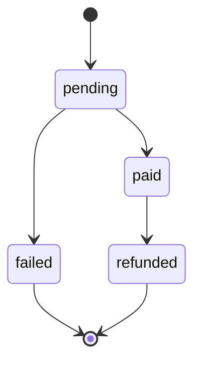

# C-line Platform Middleware Plan

Date: 2026-06-05

## Scope

C-line owns the platform layer that helps Web2 users discover, pay for and access agents without understanding the chain path.

This PR keeps the first slice intentionally small:

1. Expand the `listed` catalog with mainstream agents so recommendation has enough candidates.
2. Add a deterministic recommendation contract that A-line can call from `/recommend`.
3. Add the fiat / credits order state machine needed before access bridging.

Out of scope for this PR:

- Real payment provider integration.
- Operator-wallet chain writes.
- Contract changes.
- FARR dynamic reputation integration.

## Recommendation Contract

Request:

```json
{
  "query": "low-risk customer support knowledge-base API",
  "scenarioIds": ["customer-support"],
  "accessTypes": ["api"],
  "maxRiskLevel": "low",
  "priorities": ["low-risk", "api-first"],
  "limit": 5
}
```

Response:

```json
{
  "results": [
    {
      "agentId": "intercom-fin",
      "score": 72,
      "reasons": [{ "zh": "匹配场景：客服自动化", "en": "Matches scenario: Customer support automation" }],
      "matchedScenarioIds": ["customer-support"]
    }
  ]
}
```

The current implementation is a local rule engine plus a remote API adapter. A future backend can serve the same response shape at `POST /api/recommendations`.

## Order State Machine

Allowed transitions:



Access bridging is allowed only after an order reaches `paid`, and each order can record only one chain access transaction.

## Next Contracts To Confirm

- `onOrderPaid(orderId, userId, agentId)`: C-line order service triggers access bridging.
- `hasAccessQuery(userId, agentId)`: C-line aggregates Web2 paid state and chain access state for A-line display.
- `submitReviewProxy(userId, agentId, reviewData)`: C-line decides whether to proxy Web2 reviews or wait for the voucher-based contract path.
